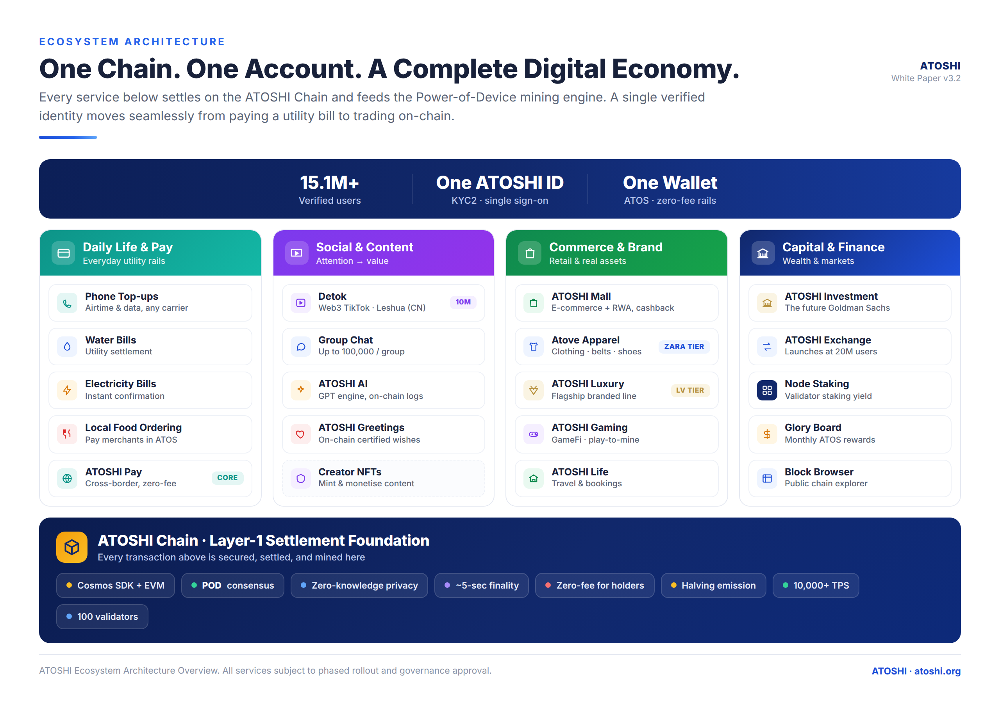
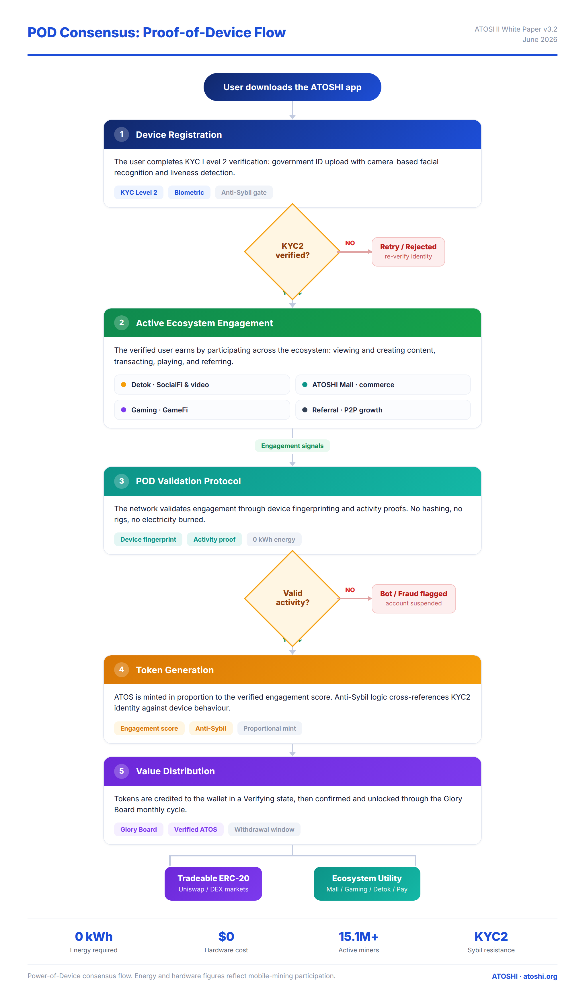

# Atoshi — 概览

## Atoshi 是什么

Atoshi 是一条围绕一个简单理念设计的**双层公链**:

> 普通用户不该为 gas 付费。持有链的原生代币,本身就应该*是* gas。

具体来说,Atoshi 由两层组成:

- **L1** —— 一条内置 EVM 执行层(通过 Ethermint)的 Cosmos SDK 链。主网 chain id `atoshi_88188-1`(EVM `88188`);测试网 `atoshi_88288-1`(EVM `88288`)。它运行核心经济模块:代币释放、价格预言机、能量记账,以及原生跨层桥合约。
- **L2(chain id 67890)** —— 一条 Polygon CDK zkEVM rollup,承载隐私池和高吞吐智能合约。L2 通过零知识证明继承 L1 的安全性。

两层都以原生代币 **ATOS** 结算。ATOS 可在两层间双向跨桥,并且是唯一的手续费资产。

> 上图是**生态**视角(各产品都在 ATOSHI Chain 上结算)。本套文档讲的是 **L1 链本身**。下图面向消费者的 "Power-of-Device (POD)" 移动挖矿是**应用层**的参与激励系统,用于在主网前铸造 ERC-20 并为迁移空投供给 —— 它**不是** L1 共识(L1 共识是 CometBFT 权益证明)。

## 我们解决什么问题

公链在三个目标之间存在结构性张力:

1. **无需许可的准入** —— 任何人都能交易。
2. **抗垃圾交易** —— 稀缺的区块空间必须定价。
3. **好用的体验** —— 手续费不应成为每次操作的摩擦。

多数链靠牺牲 (3) 来满足 (1) 和 (2):用波动的原生代币给 gas 定价,逼用户不断充值。Atoshi 走另一条路:**用"持币"而非"花币"来给交易权定价**。

只要你持有足够的 ATOS,钱包就会按固定速率*累积*交易能力(我们称之为"能量"),上限由余额决定。花费能量在代币层面是免费的 —— 只强制底层的 ATOS 持有门槛。

持有 30,000 ATOS 的用户,每 24 小时获得 50,000 gas 单位的免费交易额度,并持续回充。持有 1,000,000 ATOS 的用户还额外获得免费的合约部署额度。持仓更少、或想发送超过额度的用户,回退到标准 gas 计费的交易 —— 但门槛很低。

## 为什么双层

Cosmos SDK 给了我们:

- **成熟的模块组合** —— bank、staking、governance、IBC、ethermint EVM,加上我们自定义的模块(energy、oracle、tokenomics)全都是标准 SDK 模块。
- **验证人驱动的出块** —— 从第一天起就是权益证明,不需要 PoW 过渡。
- **原生账户抽象** —— 每个账户既是 EVM `0x...` 地址,也是 Cosmos `atoshi1...` bech32 地址,底层共用一把 secp256k1 密钥。

Polygon CDK 给了我们:

- **L2 上的 EVM 等价吞吐** —— 隐私池和高频 dApp 在这里运行。
- **有效性证明** —— 每个 L2 区块都由 L1 上的 zkSNARK 验证,因此提现是信任最小化的。
- **规范化的桥** —— L1 桥合约上的 `bridgeAsset` 与 `claimAsset`,在 L2 上镜像。

L1 保持小巧、克制、模块化;L2 吸收可编程性的长尾,而不让共识层臃肿。

## 关键数字

| 属性 | 值 |
|---|---|
| 原生代币 | ATOS |
| 原子单位 | 1 ATOS = 10^18 aatos(精度与 ETH 相同) |
| L1 出块时间 | 设计 ~5 秒(当前实测 ~3.5 秒) |
| L2 出块时间 | ~2 秒 |
| L1 chain id | `atoshi_88188-1` 主网(EVM 88188)/ `atoshi_88288-1` 测试网(EVM 88288) |
| L2 chain id | 67890 |
| Bech32 前缀 | `atoshi` |
| 密钥方案 | ethsecp256k1(兼容以太坊) |
| 交易签名哈希 | keccak256 |
| 总供应量 | 10 万亿 ATOS(矿工池 1 万亿 / 项目池 8.9 万亿 / 迁移池 1000 亿) |
| 减半周期 | 每 25,228,800 块(5 秒设计下约 4 年) |
| 首日流通 | 1000 亿 ATOS(迁移池提供初始流通盘) |

## 核心设计选择

这些是让 Atoshi 与众不同的决策。每一项都有独立章节详述;本节是导览。

### 1. 用能量替代 gas

标准 EVM 链对每笔交易按 `gasPrice * gasUsed` 收取原生代币。Atoshi 的 L1 Cosmos 链用两级模型替代:

1. **能量优先。** 签名者账户持续累积 `TxEnergy`,上限为 `floor(余额 / 30,000 ATOS) × 50,000` 单位。每笔交易从这个池子里消耗。
2. **ATOS 兜底。** 若能量不足,链对*不足部分*按固定价格用 ATOS 收费(当前 0.0021 aatos/gas 单位)。持仓足够的用户永远看不到这一步。

能量在 24 小时内线性再生(只要满足持有门槛,与持仓多少无关)。能量在代币层面不可转移,但可以*委托* —— 一个账户可以把能量借给另一个账户一段固定时间,方式是锁定相应的 ATOS 作为抵押。这让"代付交易"服务成为可能,而无需交出资产保管权。

被补贴的消息类型(如 `MsgDelegateEnergy`、`MsgUndelegateEnergy`、链上领取类消息)甚至跳过能量检查 —— 完全免费。见[能量模块](./modules/01-energy.md)。

### 2. 由链上价格驱动的代币释放

ATOS 供应按一个取决于链上预言机观测到的真实 ATOS/USD 价格和 24 小时成交量的机制解锁。链跟踪一个**递增阶梯**的价格/成交量档位(T0、T1、……,每档下限比上一档高 1.1 倍)。连续 30 个 epoch 同时守住两个下限,就从矿工池和项目池释放当前流通量的 5%。任一 epoch 跌破任一下限,计数清零。

这把代币发行与需求耦合起来 —— 供应曲线是内生的,而非预先设定。见[代币经济模块](./modules/02-tokenomics.md)和[释放计划](./economics/02-release-schedule.md)。

### 3. 原生 zkEVM 隐私

L2 承载一个**隐私池(shield pool)**合约:用户存入 ATOS 或 wATOS,得到一个 Pedersen-Poseidon 承诺,并可通过提交 Groth16 证明来私密地花费该承诺。提现只暴露目标地址和金额 —— 发送方历史被隐藏。

隐私交互可以选择通过 `EnergySettlement` 合约用 L1 能量来结算 gas,因此对持仓用户而言私密交易同样可以免费。见[隐私模块](./modules/07-privacy.md)以及 [`privacy/`](./privacy/) 深入章节。

### 4. Ethermint 密钥兼容

一把 secp256k1 私钥同时给用户:

- 一个 EVM `0x...` 地址(`keccak256(pubkey)[12:32]`)
- 一个 Cosmos `atoshi1...` bech32 地址(`bech32_encode("atoshi", <相同的 20 字节>)`)

两个地址指向同一个链上账户。钱包只需管理一把密钥。Cosmos 消息的交易签名用 `keccak256(SignDoc)` 而非原生 Cosmos 的 `sha256`,但除此之外 SDK 流水线不变。见[账户](./architecture/05-accounts.md)。

## 不在范围内的东西

我们对 Atoshi 做什么、不做什么很明确:

- **不是 meme 币平台。** 在 L2 上发资产没问题,但没有内置发射台,我们也不补贴创作者。
- **不是默认隐私链。** 隐私通过 L2 隐私池自愿开启。L1/L2 的基础账本是透明的。
- **不是 IBC 优先。** 链启用了 IBC(因为 Cosmos SDK 自带),但在 v1 里它不是主要集成目标。
- **不是 DeFi 中心。** L1 保持极简;L2 是无需许可的 EVM,但核心研发聚焦于隐私 + 能量原语,而非 AMM 或借贷。

## 如何阅读本套文档

文档按**抽象层次**组织,而非按文件:

- **00 概览**(本页)→ 为什么
- **architecture/** → 系统层面的怎么做
- **modules/** → 按 Cosmos SDK 模块的怎么做(每模块一个文件,含 proto 结构、参数、消息级行为、边界情况)
- **economics/** → 代币层面决策的为什么
- **privacy/** → ZK 构造、威胁模型、电路细节
- **reference/** → 面向集成方的 API + 手册材料

每个模块章节都遵循同一模板:目的 → 状态 → 消息 → 查询 → 事件 → 参数 → 边界情况 → 相关模块。读懂一个,就会导航其余所有。

## 状态

| 项 | 状态 | 备注 |
|---|---|---|
| L1 主网 | 仅测试网 | chain id 88288,公共测试网端点已上线 |
| L2 主网 | 仅测试网 | chain id 67890;桥的 claim 路径正在加固 |
| 能量模块 | 已上线 | 参数可治理调节 |
| 隐私池 | 仅测试网,阶段 2 | 电路已审计,但尚未进入主网钱包 UI |
| 桥 claim(L2→L1) | 部分 | 存款可用,claim 流程在积极开发中 |

---

*最后审阅:2026-07-13*
