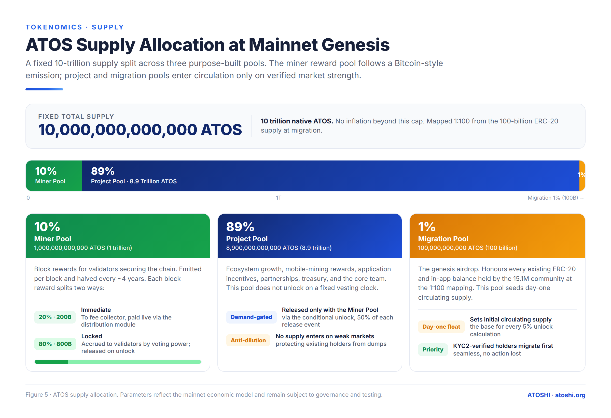

# Supply and circulation

This chapter explains where ATOS comes from, where it goes, and why the curve looks the way it does. The numerical schedule (block reward amounts, halving timing, tier thresholds) is in [Release schedule](./02-release-schedule.md); this chapter is the conceptual layer.

> **Source of truth:** all numbers below are the chain defaults in `x/tokenomics/types/helpers.go` (`DefaultParams`), which match the ATOSHI White Paper v3.2 economic model.

## Top-line numbers

| Quantity | Amount | Source |
|---|---|---|
| **Maximum supply** | 10,000,000,000,000 ATOS (10 trillion) | Fixed cap; sum of the three pools |
| **Miner Pool** | 1,000,000,000,000 ATOS (1 T, 10%) | `MinerPoolTotal` — block rewards |
| **Project Pool** | 8,900,000,000,000 ATOS (8.9 T, 89%) | `ProjectPoolTotal` — ecosystem, treasury, team |
| **Migration Pool** | 100,000,000,000 ATOS (100 B, 1%) | `MigrationPoolTotal` — genesis airdrop, seeds day-one float |
| **Day-one circulating** | = Migration Pool (100 B) | Everything else enters via emission + conditional release |
| **Atomic unit** | 1 ATOS = 10^18 aatos | EVM-style precision |

The 10-trillion native supply is mapped **1:100** from the 100-billion ERC-20 supply at mainnet migration (1 ERC-20 ATOS → 100 native ATOS). This is a denomination change, not dilution — the 100-billion Migration Pool exists to honour every ERC-20 and in-app balance in full.



## Three pools, three roles

### Miner Pool — 1 trillion (10%)

Block rewards for validators. Emitted block by block on a Bitcoin-style halving schedule (initial 19,819 ATOS/block, halving every 25,228,800 blocks ≈ 4 years by design). The infinite geometric series converges to — but never exceeds — the 1-trillion cap. Each block reward splits **20% immediate / 80% locked** (see [Block rewards](./04-block-rewards.md)).

### Project Pool — 8.9 trillion (89%)

Ecosystem growth, mobile-mining rewards, application incentives, partnerships, treasury, and the core team. It does **not** unlock on a fixed vesting clock. It enters circulation only alongside the Miner Pool through the conditional tier release (50% of each release event), protecting holders from scheduled dilution into a weak market.

### Migration Pool — 100 billion (1%)

The genesis airdrop that honours existing ERC-20 and in-app balances at the 1:100 mapping. It seeds day-one circulating supply. KYC2-verified holders migrate first. Unclaimed migration ATOS at the cutoff sweeps into the Project Pool.

## How supply enters circulation

Exactly three taps, all publicly computable:

### 1. Block reward (continuous, validator-paid)

Every block, `x/tokenomics` mints `current_reward` aatos from the Miner Pool and credits the proposer. Of each block reward:

- **20% immediate** → fee collector → paid via `x/distribution` (less the 2% community tax) to validators and delegators. Liquid.
- **80% locked** → validators' `MinerLockedBalance.locked_amount` by voting power. Released only by the conditional tier engine (#3). Not paid to delegators.

Initial reward: 19,819 ATOS/block; halves every 25,228,800 blocks. Cycle 0 emits ~500 B (half the Miner Pool); the series → 1 T.

### 2. Migration claims (one-shot per holder)

ERC-20/in-app holders submit a Merkle proof to `MsgClaimMigrationTokens` and receive native ATOS. Bounded by the 100-billion Migration Pool; recorded in `total_migration_claimed`. Once fully claimed, further proofs fail. Unclaimed at the cutoff sweeps into the Project Pool.

### 3. Conditional tier release (oracle-priced, demand-gated)

The novel one. Supply follows demand: new tokens unlock only when the market proves sustained strength, and every unlock raises the bar for the next.

- **Escalating ladder.** Tier 0 requires price ≥ $0.15 **and** 24h volume ≥ $150,000. Each tier lifts both floors ×1.1 (T1 = $0.165 / $165k, …, Tₙ = $0.15 × 1.1ⁿ). The ladder is unbounded.
- **Sustained, not averaged.** Both floors must hold on **30 consecutive** daily epochs. The chain checks every `price_check_epoch_blocks` (17,280 blocks ≈ 1 day by design). A single epoch below either floor resets the counter to zero.
- **Release.** When a tier is satisfied, **5% of current circulating supply** unlocks, drawn **50% Miner Pool / 50% Project Pool** (if the Miner Pool can't cover its half, the remainder comes from the Project Pool).

Released miner-pool ATOS is claimed by validators (`MsgClaimMinerLockedReward`); project-pool ATOS goes to the treasury (`MsgClaimProjectTreasuryReward`, gov-disbursed). Detailed thresholds and worked examples in [Release schedule](./02-release-schedule.md).

## Where supply does NOT come from

No continuous inflation outside block reward. Unlike Cosmos Hub's `x/mint`:

- `x/staking` does **not** mint inflation. Validator income = block reward + tx fees only.
- The treasury does **not** mint; it receives tier-event releases and project-treasury rewards.
- The bridge does **not** mint at L1; wATOS on L2 is 1:1 against locked L1 ATOS.

So **circulating supply = Migration Pool (100 B) + cumulative immediate block rewards + cumulative Miner Pool released + cumulative Project Pool released.** No hidden taps.

## Where supply goes (sinks)

### Burn (rare, today none by default)

The chain does **not** currently run an EIP-1559-style base-fee burn. Energy shortfall fees go to the standard `fee_collector` module account, not burned. (Note: the White Paper's "micro-fee partly burned" description is aspirational — the implemented energy ante-handler routes shortfall fees to the fee collector; any burn fraction would be a future governance change.) The supply curve is monotonically non-decreasing today.

### Locked (on-chain but not circulating)

- **Validator self-bond** (`x/staking`) — bonded stake.
- **Energy delegation collateral** (`x/energy` `energy_locked_pool` module account) — held during active delegations.
- **Bridge locked** (L1 bridge contract) — backing wATOS on L2.

The `circulating_supply` query subtracts these.

## The circulating-supply query

```text
GET /atoshi/tokenomics/v1/circulating_supply
```

Returns the aatos amount meeting the chain's definition of "circulating" — the additive formula above, with each component read from its source-of-truth keeper (not approximated). Use this for market-cap dashboards and exchange listings.

## Why this design

1. **Tier-driven release ties issuance to demand.** Issuing a fixed schedule into a thin market depresses price. Atoshi releases more when the market is strong (tier sustained) and pauses when it cools.
2. **80% locked block reward aligns with PoS security.** Validators earn the liquid 20% now and accrue the locked 80%, harvested only as the market strengthens — binding security to long-term value.
3. **Migration honours early holders** via a direct claim path (no centralized airdrop).
4. **No inflation hook = clean accounting.** Anyone can compute the curve from genesis state + observed tier events.

## Reading the supply curve

| Query | Returns |
|---|---|
| `GET /atoshi/tokenomics/v1/release_status` | Current tier, consecutive epochs at tier, cumulative miner / project / immediate totals |
| `GET /atoshi/tokenomics/v1/circulating_supply` | One number, aatos |
| `GET /atoshi/tokenomics/v1/block_reward` | Per-block mint at the current halving epoch |

Combined with the oracle price feed, these reconstruct the full supply state and project near-term issuance.

---

*Last reviewed: 2026-07-12*
