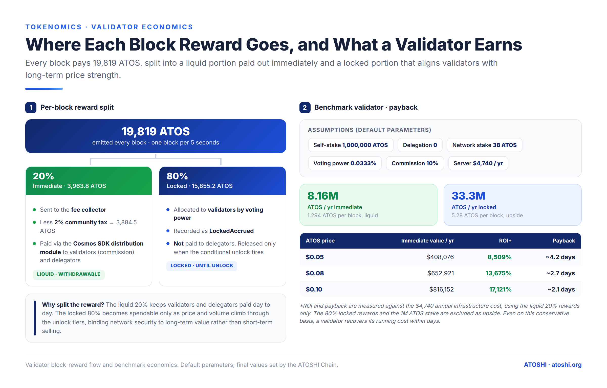

# 区块奖励与验证人收入

本章是 [`x/tokenomics`](../modules/02-tokenomics.md) 和[发行计划](./02-release-schedule.md)
的验证人经济学配套说明。
它逐步讲解验证人赚取的每一 aatos 如何流经
链路,从出块到可领取余额。

## 两条收入渠道

验证人的总收入分解为:

```
total_income = immediate_share + locked_share_claimable_so_far + tx_fee_share

where:
  immediate_share        = Σ over blocks proposed (20% of current_reward)
  locked_share_claimable = Σ over tier-release events × (this validator's locked share / total locked)
  tx_fee_share           = Σ over blocks × (fee_collector amount × validator's stake share)
```

前两项是发行收入(新铸造的 ATOS)。第三项是
交易手续费收入(不涉及铸造)。在低交易量的链上,**发行
主导**,领先若干数量级。

## 即时份额 —— 20% 区块奖励

当验证人出块时,`x/tokenomics` 的 `BeginBlocker` 铸造
`current_reward` ATOS。其中:

- `immediate_reward_bps = 2000`(20%)流经 `x/distribution` 的
  标准验证人奖励路径
- `locked_reward_bps = 8000`(80%)累积在验证人的
  `MinerLockedBalance.locked_amount` 中

这 20% 由 `x/distribution` 按普通验证人奖励一样分配:

1. 先扣除验证人的 `commission_rate`
2. 余下部分按委托人抵押比例分配
3. 委托人通过 `MsgWithdrawDelegatorReward` 领取
4. 验证人通过 `MsgWithdrawValidatorCommission` 自领佣金

这是**标准 Cosmos 行为** —— 没有 Atoshi 特有逻辑。唯一
Atoshi 特有的细节是出块者是这 20% 的唯一
接收方(同一区块中其他验证人只通过其手续费的
投票权份额赚取,而非区块奖励)。

### 每块计算

在默认参数与当前测试网条件下(作为主网的代理):

```
current_reward    = 19,819 ATOS / block
immediate_share   = 19,819 × 0.20 = 3,963.8 ATOS / block
locked_share      = 19,819 × 0.80 = 15,855.2 ATOS / block (to proposer's locked balance)
```

按 17,280 blocks/day(5 秒设计出块时间):

```
Total daily immediate distribution = 17,280 × 3,963.8 = ~68.5 M ATOS / day
Total daily locked accumulation    = 17,280 × 15,855.2 = ~274.0 M ATOS / day
```

这些数字随时间按各验证人在出块中的份额分摊。
若有 4 个等抵押的验证人:

```
Per-validator daily immediate = ~17.1 M ATOS / day
Per-validator daily locked    = ~68.5 M ATOS / day (in locked_amount, NOT claimable yet)
```

按 $0.15/ATOS,即每个验证人每天约 $2.57 M 即时。这些是
周期 0 的发行数字(第 0–4 年);区块奖励每 25,228,800
个区块减半,因此该收入流每约 4 年周期减半一次。

> 线上各链当前出块快于 5 秒设计
> (截至 2026-07,主网约 3.5 s / 测试网约 3.4 s),这将每天区块数
> 提升到约 24,700,并按比例提升每日数字。计划是恢复
> 5 秒目标(`timeout_commit`);见
> [发行计划](./02-release-schedule.md)中的出块时间说明。



## 锁定份额 —— 等待档位释放的 80%

锁定份额不会直接进入验证人账户。它
累积在链级 `tokenomics_miner_pool` 模块账户中,
每个验证人的归属跟踪于:

```
MinerLockedBalance {
  validator_address: string
  locked_amount:     string  // not yet claimable
  claimable_amount:  string  // unlocked by tier release, ready for MsgClaimMinerLockedReward
}
```

### 锁定如何变为可领取

档位释放事件([发行计划](./02-release-schedule.md))
解锁矿工池的一部分:

```
At each release event:
  released_to_miner_pool = circulating_supply × release_percentage_bps / 10000 × miner_release_share_bps / 10000
                        = circulating_supply × 0.05 × 0.50
                        = 2.5% of circulating supply

For each validator v:
  validator_share = v.locked_amount / Σ all validators' locked_amount
  v.claimable_amount += released_to_miner_pool × validator_share
  v.locked_amount    -= released_to_miner_pool × validator_share
```

重要:出块更多(随时间累积)的验证人会积累
更大的 `locked_amount`,因此他们在每次释放中获得更大的
份额。出块奖励大致与抵押成比例(因为
CometBFT 按抵押加权随机选择出块者),所以锁定
份额大致与抵押成比例 —— 但带有随时间平滑的
随机波动。

### 验证人领取锁定

一旦 `claimable_amount > 0`,验证人的运营者调用:

```
MsgClaimMinerLockedReward {
  validator_address: "atoshivaloper1..."
}
```

签名者必须是运营者账户。将 `claimable_amount` ATOS 从
矿工池模块账户转入验证人的提取地址。
将 `claimable_amount` 重置为零;`locked_amount` 继续从
后续区块累积。

该消息在[能量补贴白名单](../modules/01-energy.md)上:
验证人领取时支付零 gas —— 他们可以立即领取,
即便账户余额为零。

## 交易手续费份额

由能量 ante-handler(Cosmos 不足)和 EVM ante-handler(gas)
两者收取的手续费都累积在 `fee_collector` 模块
账户中。SDK 的 `x/distribution` 每个区块清扫它并
按投票权比例分给活跃验证人。

在当前的低链上交易量下,这个数字微不足道:

```
Average tx fee = 100,000 gas × 0.0021 aatos/gas (Cosmos route) ≈ 0
Average tx fee = 21,000 gas × 1 gwei (EVM route)               = 0.000021 ATOS

Daily volume = 100 tx (estimate)
Daily fee revenue total = 100 × 0.000021 = 0.0021 ATOS
```

按 $0.15/ATOS,那是全体验证人合计每天 **$0.000315** 的
手续费。基本是噪声。**区块奖励领先 8 个以上数量级。**

只有当链上交易量升至以太坊主网级别(持续
数千 tx/s)时,情况才会改变,那时手续费或许变得
不容忽视。在此之前,验证人基本只从发行赚取。

## 端到端验证人损益(示例)

一个占总抵押 25% 的验证人,运行一年,持续
T1 价格(每 30 天一次释放事件,每次为流通供应量的 5%):

### 即时收入

```
Yearly blocks (total)  = 6,307,200  (5-second design)
Blocks proposed (25%)  = 25% × 6,307,200 = 1,576,800 blocks
Immediate / block      = 3,963.8 ATOS
Yearly immediate       = 1,576,800 × 3,963.8 ≈ 6.25 B ATOS  (cycle 0)
```

这是**设计中的**周期 0 发行,并非错误:矿工池
为 1 万亿 ATOS,周期 0(第 0–4 年)发行其中约 500 B,其中
20%(约 100 B)是全体验证人分享的即时收入流 —— 25%
出块者份额约为 6.25 B/year。该收入流**每
25,228,800 个区块(约 4 年)减半**,所以周期 1 约为 3.13 B/year,
以此类推。按百分比计,25% 的验证人在周期 0 期间
每年赚取即时奖励约占总供应的 0.06%。

### 锁定累积

```
Locked / block to this validator = 15,855.2 ATOS × (locked accumulated by them) / pool total
```

这以非线性方式复利 —— 每次释放都同时减少他们的锁定
和池,而累积速率还取决于他们出的新块占多大
比例。用模拟建模最为简便。

### 档位释放可领取

```
T1 release event yields 2.5% of circulating to the miner pool
Validator's claim = 2.5% × circulating × (their locked / total locked)
For a 25% stake validator: roughly 25% of the 2.5% = 0.625% of circulating
```

因此每次档位释放事件,该验证人可领取约 0.625% 的
流通供应量。在流通量 200 B 时,即每次释放约 1.25 B ATOS。

### 年度汇总(粗略数量级,周期 0,持续 T1)

```
Immediate           ~6.25 B ATOS  (25% proposer share, cycle 0)
Locked claimed      ~15 B ATOS    (~12 releases × ~1.25 B)
Fees                ~0
Total               ~21 B ATOS / year
                    (sustained T1 across all 12 months)
```

这些绝对数字之所以庞大,只是因为总供应量是 10 万亿
—— 按相对值,验证人每年赚取供应的百分之几分之一,
恰如 1 万亿矿工池 / 8.9 万亿项目池的
拆分所意图的那样。即时收入流每约 4 年周期减半。

## 熊市情形下的验证人经济学

同一验证人,但持续 T0(无档位释放):

```
Immediate           ~6.25 B ATOS
Locked accumulated  ~25 B ATOS (sits in the pool, unclaimable)
Fees                ~0
Total claimed       ~6.25 B ATOS / year
Unclaimed potential ~25 B ATOS (waits for tier resume)
```

无论档位如何,验证人都赚取即时份额。80% 的
锁定份额是有条件的 —— 他们累积它,但只有在链的
价格档位持续时才能领取。这就是**对齐机制**:
验证人是为链的成功获得报酬,而不仅仅是为出块。

## 罚没及其影响

适用标准 Cosmos 罚没:

| 违规 | 惩罚 |
|---|---|
| 双签 | 已绑定抵押的 5%(`slash_fraction_double_sign`) |
| 掉线(100 区块窗口内错过 50%+ 区块) | 已绑定抵押的 1%(`slash_fraction_downtime`) |

罚没影响:
- **已绑定抵押**:减少
- **自抵押与委托人抵押**:按比例减少
- **锁定奖励(MinerLockedBalance)**:当前参数下**不**罚没

一个双签的验证人损失其已绑定抵押的 5%,但保留
其累积的锁定奖励。是否也罚没锁定奖励是
未来的治理决策 —— 利(更强的对齐)vs 弊
(不惩罚那些已停止作恶但仍持有旧
锁定余额累积的验证人)。

## 委托人 vs 验证人视角

委托人获得:
- 即时 20% 的份额(扣除验证人佣金后)
- 交易手续费的份额(扣除佣金后)
- **锁定 80% 的零份额** —— 那部分全部流入验证人的 MinerLockedBalance

若委托人想参与锁定份额,他们需要:
- 运行自己的验证人,或
- 找到一个低佣金且拥有大额锁定余额的验证人,并信任其会再分配

链不强制向委托人分配锁定份额。这
是对标准 Cosmos 行为的偏离。理由:80% 的锁定
是一种验证人对齐机制,而非委托人奖励。委托人
已经通过即时份额获得收益。

这**确实**改变了验证人选择动态:委托人可能偏好
拥有强劲锁定份额累积的高佣金验证人,
而非低佣金的新人。

## 运营查询

```
GET /atoshi/tokenomics/v1/miner_locked_balance/{validator_address}
{
  "balance": {
    "validator_address": "atoshivaloper1...",
    "locked_amount":     "... aatos",      // not yet claimable
    "claimable_amount":  "... aatos"       // ready to MsgClaimMinerLockedReward
  }
}
```

验证人定期检查它以判断何时领取。

```
GET /atoshi/tokenomics/v1/release_status
```

返回包含各项总额的链级状态。验证人用它查看
近期档位释放活动(可领取余额是否可能增加的信号)。

## 与同类 Cosmos 链的对比

| 链 | 区块奖励来源 | 锁定 / 归属? | 档位条件化? |
|---|---|---|---|
| Cosmos Hub | x/mint(通胀) | 否,即时可领取 | 否 |
| Osmosis | x/mint + epochs | 流动性挖矿被锁定 | 否 |
| Sei | x/mint | 否 | 否 |
| Stride | x/mint | 否(但很小) | 否 |
| **Atoshi** | **x/tokenomics(固定计划)** | **是(每块锁定 80%)** | **是(档位驱动释放)** |

Atoshi 的设计比典型的 Cosmos
"全部即时分配"模式更为保守。其意图是在数年间
对齐验证人与链的成功,而非在单个区块间。

## 未来调优

可能的治理动作:

1. **恢复 5 秒出块时间** —— 截至 2026-07,线上各链以
   约 3.5 s(主网)/ 约 3.4 s(测试网)出块,因此基于区块数的
   参数(`halving_interval_blocks = 25,228,800` ≈ 4 年,
   `price_check_epoch_blocks = 17,280` ≈ 1 天)当前映射到更短的
   挂钟周期(约 2.8 年、约 16.8 h)。把 `timeout_commit`
   恢复到 5 s 可复原预期的日历语义。(`initial_block_reward`
   本身是正确的 —— 它是设计中的 1 万亿矿工池发行,
   而非过大的占位值。)
2. **或者,将基于区块数的参数重新调整**到实测速率
   (4 年周期 ≈ 36 M 区块,每日检查 ≈ 24,700 区块 @ 3.5 s)。
3. **可能加入对锁定奖励的罚没** —— 强化对齐
   但有争议。
4. **考虑向委托人开放锁定份额** —— 改善
   委托人经济,可能以验证人安全对齐为代价。

这些都不紧急。当前的测试网参数适用于
机制测试;主网参数将在一次协调的治理事件中设定。

## 相关

- [Tokenomics 模块](../modules/02-tokenomics.md) —— 机制 + 状态规范
- [发行计划](./02-release-schedule.md) —— 供应曲线细节
- [供应概览](./01-supply.md) —— 三个池 + 汇出口
- [治理案例研究](../modules/09-governance.md) —— 如何提出参数变更

---

*最后审阅:2026-07-12*
