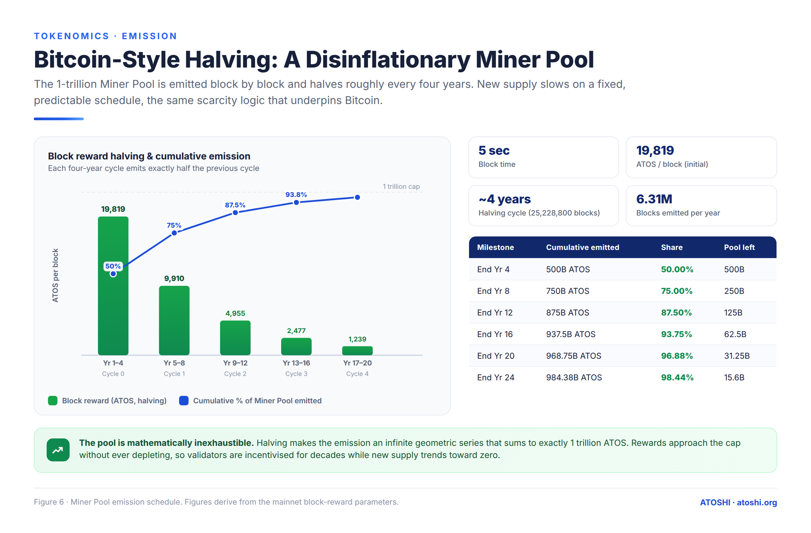
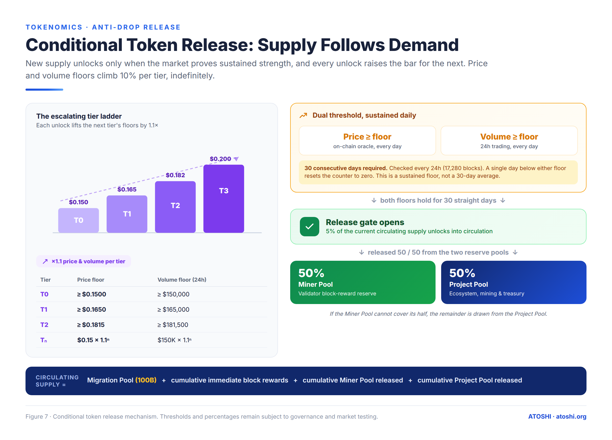
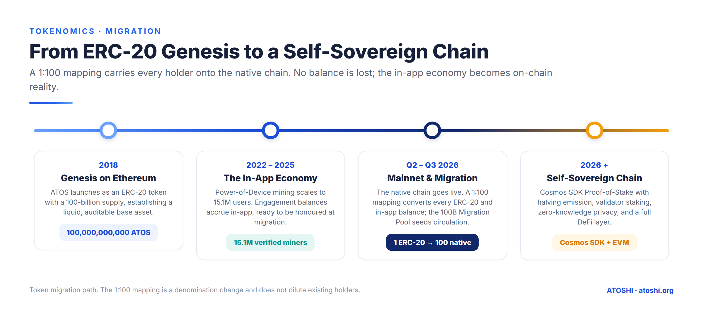

# `x/tokenomics` —— 供应发行、减半、档位驱动的释放

本模块管理 ATOS 如何进入流通。它拥有区块奖励铸造钩子、锁定的矿工池、项目金库池、迁移池,以及决定锁定 ATOS 何时解锁的价格档位释放机器。

## 思维模型

创世时有三个 ATOS 储库:

```
┌─────────────────────────────────────────────────────────────┐
│  Total supply (10 T ATOS, hard cap)                          │
│                                                              │
│  ┌──────────────┬──────────────────┬────────────────────┐   │
│  │ Migration    │ Miner pool       │ Project pool       │   │
│  │ pool (1%)    │ (10%)            │ (89%)              │   │
│  └──────────────┴──────────────────┴────────────────────┘   │
│         │              │                     │               │
│         ▼              ▼                     ▼               │
│   Old-chain        Block reward         Treasury releases    │
│   holders         (proposer mint)       (gov-controlled)     │
│   claim by         + locked              + tier-driven       │
│   Merkle proof     unlock streak         unlock streak       │
└─────────────────────────────────────────────────────────────┘
```


有三条路径把 ATOS 从储库送入流通:

1. **区块奖励** —— 每块铸造 `current_reward` aatos。20% 通过 `x/distribution` 即时发给出块提议者;80% 累积到验证人各自的锁定余额中,验证人日后可以领取,*但只有在档位连续计数将其解锁之后*。
2. **迁移领取** —— 预挖代币持有者提交带 Merkle 证明的 `MsgClaimMigrationTokens`。验证一次,支付一次。
3. **档位释放** —— EndBlocker 监视链上价格(来自 `x/oracle`)。如果价格连续 `consecutive_days_required` 个 epoch 维持在档位 N 的阈值之上,就释放相关池的 `release_percentage_bps`。价格跌破该档位会重置连续计数。

新颖之处在于第 3 条:供应对市场价格是内生的。

## 状态

### `ReleaseState`

单条全局记录。跟踪我们在档位释放机器中的位置。

```
message ReleaseState {
  uint32 current_tier              = 1;   // T0..T3
  uint32 consecutive_days          = 2;   // streak at or above current_tier
  int64  last_check_block          = 3;
  int64  last_check_time_unix      = 4;
  string total_miner_released      = 5;
  string total_project_released    = 6;
  string total_immediate_distributed = 7;
  string total_miner_locked        = 8;
}
```

### `BlockRewardState`

```
message BlockRewardState {
  string current_reward     = 1;
  uint64 period             = 2;   // 0 before first halving
  int64  last_halving_block = 3;
}
```

### `MinerLockedBalance`

每个验证人(operator 地址)一行。

```
message MinerLockedBalance {
  string validator_address = 1;
  string locked_amount     = 2;   // aatos accumulated, not yet claimable
  string claimable_amount  = 3;   // aatos unlocked by tier release
}
```

`locked_amount` 与 `claimable_amount` 之间的拆分很重要:验证人每块都累积锁定奖励,但在档位引擎解锁一部分之前无法领取。解锁与每个验证人在总锁定量中所占份额成正比。

### 模块账户

- `tokenomics_miner_pool` —— 在按验证人归属之前,链层级的 80% 锁定份额
- `tokenomics_project_pool` —— 项目金库资金
- `tokenomics_migration_pool` —— 迁移空投分配

## 区块奖励发行

`BeginBlocker` 铸造每块奖励并进行拆分。

### 减半

减半按区块高度确定性触发:

```
period         = floor((current_height - genesis_height) / halving_interval_blocks)
current_reward = initial_block_reward / 2^period
```

默认参数:`initial_block_reward = 19,819 ATOS`、`halving_interval_blocks = 25,228,800`(在 5 秒设计出块时间下约 4 年)。奖励取自 1 万亿的 Miner Pool;第 0 周期发行约 5000 亿(池的一半),几何级数收敛到 1 万亿。

| 周期 | 每块奖励 |
|---|---|
| 0(第 0–4 年) | 19,819 |
| 1(第 4–8 年) | 9,909.5 |
| 2(第 8–12 年) | 4,954.75 |
| 3(第 12–16 年) | 2,477.375 |

铸造受 1 万亿 Miner Pool(10 万亿总供应的 10%)约束——一旦累计发行会超过该池,链就把它封顶到剩余额度。

> 当前运行的链比 5 秒设计更快(约 3.5 秒),因此目前一个减半 epoch 约 2.8 年即可走完;每周期的 ATOS 数量不受影响(基于区块计数)。出块时间说明参见 [释放时间表](../economics/02-release-schedule.md#block-reward-halving-table)。



### 拆分:20% 即时 / 80% 锁定

每块:

- `immediate = current_reward × immediate_reward_bps / 10000`(默认 20%)—— 通过 `x/distribution` 发给提议者。可即时花费。
- `locked = current_reward × locked_reward_bps / 10000`(默认 80%)—— 加到提议者的 `MinerLockedBalance.locked_amount`。尚不可领取。

这些比例可由治理调整,但必须相加等于 10000。

### 为什么锁定 80%

验证人最终会按其工作量比例获得报酬,但锁仓产生两种效应:

- **利益绑定(skin in the game)。** 一个恶意双签或下线的验证人,失去的是对一笔不断增长的锁定储备的访问权,而不仅仅是即时份额。
- **与档位机制耦合。** 锁定储备只有在链的价格档位持续维持时才解锁。因此验证人被激励去关注链的长期价格强势,而不只是短期出块。

## 档位驱动的释放

本模块最具特色的部分。

### 档位定义

档位是一个**无上界**的阶梯,索引为 0…n(`Tₙ = price_base × tier_multiplier^n`);为便于说明仅展示前四档:

```
threshold_T0 = price_base                          (e.g. $0.15)
threshold_T1 = price_base × tier_multiplier        (e.g. $0.165)
threshold_T2 = price_base × tier_multiplier^2      (e.g. $0.1815)
threshold_T3 = price_base × tier_multiplier^3      (e.g. $0.19965)
```

成交量同理为 `volume_base × tier_multiplier^n`。价格和成交量都必须越过该档位的阈值。



### 连续计数引擎

每隔 `price_check_epoch_blocks`(默认约合 24 小时的区块数),EndBlocker 从 `x/oracle` 读取 TWAP 价格和 24 小时成交量,然后:

1. 确定*当前可达档位*(价格和成交量两个阈值都满足的最高 N)。
2. 与 `state.current_tier` 比较:
   - **相等**:`consecutive_days += 1`
   - **更高**:`consecutive_days = 1`,`current_tier = new`
   - **更低**:`consecutive_days = 0`,`current_tier = new`。连续计数中断。
3. **若 `consecutive_days == consecutive_days_required`**(默认 30):触发一次释放。

### 释放事件

一次触发释放*流通供应量*的 `release_percentage_bps`(默认 500,即 5%),分摊到两个池:

- 来自矿工池:`miner_release_share_bps × release`(默认 5000 = 50%)→ 按各验证人当前的 `locked_amount` 成比例分配到所有验证人的 `MinerLockedBalance.claimable_amount`。
- 来自项目池:`project_release_share_bps × release`(默认 5000)→ 发送到 `project_treasury_address`,可通过 `MsgClaimProjectTreasuryReward` 领取。

释放之后,`consecutive_days` 并**不**重置。下一次释放在再经过 `consecutive_days_required` 个 epoch 后发生(所以在 30 时:第 30 个 epoch 释放,然后 60,然后 90……)。

### 为什么基于档位

固定的发行时间表会让供应与市场健康脱钩。阈值加连续计数的设计避免了在短暂价格尖峰上倾泻供应——只有*持续的*在位才触发释放。熊市中释放完全暂停;锁定储备等待强势重现。

## 消息



### `MsgClaimMigrationTokens`

```
delegator    string    // signer's bech32
amount       string    // aatos to claim
merkle_proof bytes[]   // SHA-256 Merkle proof against params.migration_merkle_root
```

针对配置的根校验证明。成功后,把 `amount` aatos 从 `tokenomics_migration_pool` 转给签名方。记录该领取以防重复领取。在 `migration_claim_end_time_unix` 之后拒绝。

被 `x/energy` 列入白名单 → 免费。

### `MsgClaimMinerLockedReward`

```
validator_address string   // operator addr (atoshivaloper1...)
```

签名方必须是 operator 账户。把验证人的 `claimable_amount` 从矿工池模块账户转到验证人的提取地址。将 `claimable_amount` 重置为零;`locked_amount` 继续累积。

被 `x/energy` 列入白名单 → 免费。

### `MsgClaimProjectTreasuryReward`

```
authority string   // must equal params.project_treasury_address
to        string   // destination address
amount    string   // aatos
```

签名方必须等于配置的金库地址。支付 `amount` aatos。金库地址本身受治理控制——通常是一个多签。

被 `x/energy` 列入白名单 → 免费。

### `MsgUpdateParams`

标准的仅治理更新。允许改动 `migration_merkle_root`,但需要治理投票。

## 查询

| 端点 | 返回 |
|---|---|
| `GET /atoshi/tokenomics/v1/release_status` | 完整的 `ReleaseState` |
| `GET /atoshi/tokenomics/v1/circulating_supply` | 单个 aatos 数额 |
| `GET /atoshi/tokenomics/v1/block_reward` | `{current_reward, period}` |
| `GET /atoshi/tokenomics/v1/miner_locked_balance/{validator_address}` | 按验证人的余额 |
| `GET /atoshi/tokenomics/v1/project_claimable` | 可用的金库余额 |
| `GET /atoshi/tokenomics/v1/params` | 模块参数 |

## 参数

| 名称 | 默认值 | 说明 |
|---|---|---|
| `miner_pool_total` | 1 T ATOS (10%) | 硬顶(`1×10^30` aatos) |
| `project_pool_total` | 8.9 T ATOS (89%) | 硬顶(`8.9×10^30` aatos) |
| `migration_pool_total` | 100 B ATOS (1%) | 硬顶(`1×10^29` aatos) |
| `immediate_reward_bps` | 2000 (20%) | 须与 locked 相加等于 10000 |
| `locked_reward_bps` | 8000 (80%) | |
| `halving_interval_blocks` | 25,228,800(5 秒设计下约 4 年) | |
| `initial_block_reward` | 19,819 ATOS | |
| `price_base` | 0.15 USD | T0 阈值 |
| `volume_base` | 150,000 USD | T0 成交量阈值 |
| `tier_multiplier` | 1.1 | 每档因子 |
| `consecutive_days_required` | 30 | 解锁所需连续计数(epoch) |
| `release_percentage_bps` | 500 (5%) | 每次事件占流通供应量的比例 |
| `miner_release_share_bps` | 5000 | 释放中进入矿工池的拆分 |
| `project_release_share_bps` | 5000 | 进入项目池的拆分 |
| `project_treasury_address` | (治理设定) | 建议使用多签 |
| `price_check_epoch_blocks` | ~17,280(5 秒下 24 小时) | |
| `migration_merkle_root` | (创世设定) | SHA-256 |
| `migration_claim_end_time_unix` | T+1 年 | 截止期 |

## 事件

| 事件 | 触发时机 | 属性 |
|---|---|---|
| `block_reward` | 每块 | `proposer`, `immediate`, `locked`, `period` |
| `tier_advance` | EndBlocker,档位上升 | `from_tier`, `to_tier`, `price`, `volume` |
| `tier_retreat` | EndBlocker,档位下降 | 同上 |
| `release_triggered` | 连续计数达到阈值 | `tier`, `miner_amount`, `project_amount`, `consecutive_days` |
| `migration_claimed` | `MsgClaimMigrationTokens` | `claimant`, `amount` |
| `miner_reward_claimed` | `MsgClaimMinerLockedReward` | `validator`, `amount` |
| `project_reward_claimed` | `MsgClaimProjectTreasuryReward` | `recipient`, `amount` |

## 边界情况

### 如果预言机没有新鲜价格怎么办?

如果最新的预言机报告比 `oracle.params.max_price_age_seconds` 更旧,则该 epoch 跳过档位检查。连续计数器**不**推进,但也不重置。链实际上暂停档位演进,直到价格源恢复。

### 如果验证人在有锁定余额时解绑怎么办?

解绑后锁定余额仍可归属到 operator 地址。他们的 `claimable_amount` 会继续随档位释放增长,与其*被冻结的* `locked_amount` 成比例。他们仍可调用 `MsgClaimMinerLockedReward`。一旦他们不再出块,`locked_amount` 就停止累积。

### 如果迁移期结束时仍有未领取的 ATOS 怎么办?

`migration_pool_total - total_migration_claimed` 会归入项目池,扩大 `project_pool_total`。后续的迁移领取将失败。

### 为什么没有通胀钩子?

其他 Cosmos 链用 `x/mint` 持续通胀。Atoshi 采用固定区块奖励 + 档位释放,因此总供应有界且可预测。验证人奖励来自出块 + 交易手续费,而非通胀。

## 相关模块

- **`x/oracle`** —— 提供 TWAP 价格和成交量。没有新鲜数据档位引擎无法推进。
- **`x/energy`** —— 所有领取类消息都被补贴,以便零余额的用户也能领取。
- **`x/distribution`** —— 接收即时的 20% 区块奖励,应用验证人佣金。
- **`x/staking`** —— 出块的验证人通过本模块累积锁定奖励。

---

*最后审阅:2026-07-12*
