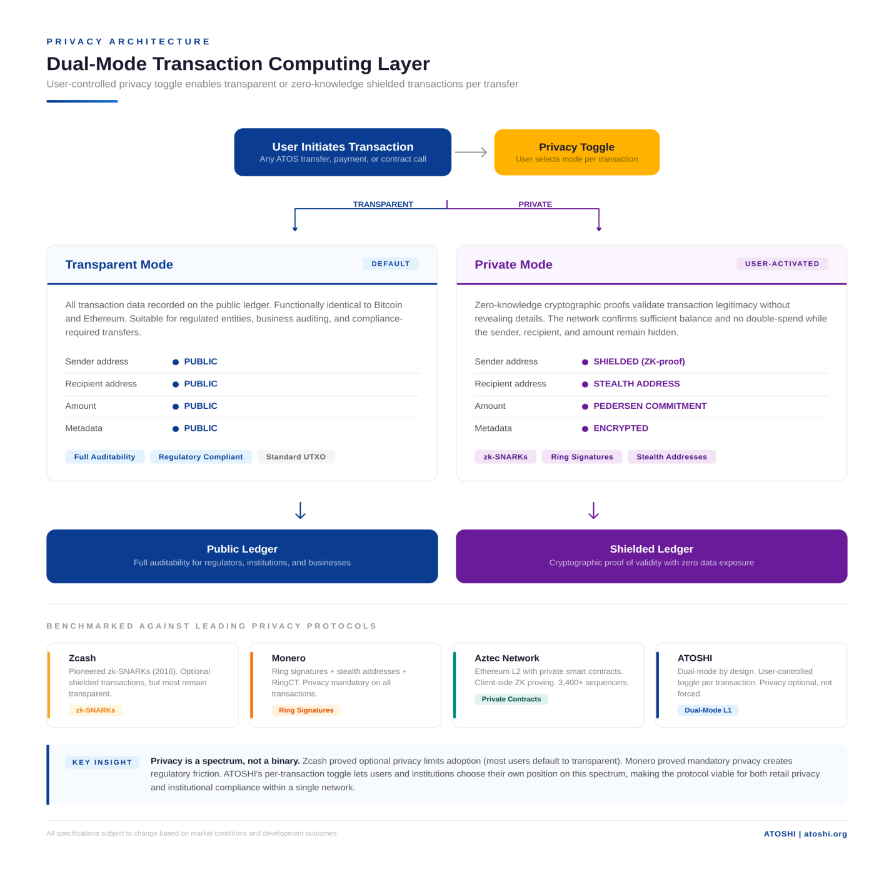

# 隐私 — L2 上的隐私交易

Atoshi 的隐私系统完全运行在 L2(Polygon CDK zkEVM)之上。它由一组 EVM 合约(`Shield`、`EnergySettlement`、`TokenRegistry`、`Verifier`)以及基于 BN254 曲线编译的 Groth16 zk 电路实现。本章是该模块的概览;深入机制请参见 [`privacy/`](../privacy/)。

## 心智模型

一笔标准的 EVM 转账会暴露(发送方、接收方、金额)。而一笔隐私转账只会暴露(金额,可能还有接收方)。发送方以及资金的历史轨迹都被隐藏。

其实现方式如下:

1. **承诺方案(Commitment scheme)。** 每一个"票据(note)"都被承诺为 `commit = Poseidon(amount, owner_pubkey, nullifier_secret)`。承诺会被追加到一棵仅可追加的 Merkle 树(即"隐私池")中。
2. **作废符方案(Nullifier scheme)。** 要花费一个票据,持有者需要公开 `nullifier = Poseidon(secret)` —— 这是一个标记,用于证明该票据已被消费,同时又不暴露具体是哪一个。链上会存储已花费的作废符;双花因此不可能发生。
3. **零知识证明。** 所有状态转换(存入、转账、提现)都用一个 Groth16 zkSNARK 来证明,它会校验旧承诺、新承诺、作废符与余额之间的关系。

Atoshi 的实现还增加了两个特色:

- **混合资产模型。** 票据可以持有原生 L2 wATOS,或一份经过筛选的 L2 ERC20 代币白名单(由 `TokenRegistry` 治理)。支持跨资产的隐私转账,但每种资产都有自己独立的子树。
- **能量结算 gas。** L2 上的 `EnergySettlement` 合约通过元交易(meta-transaction)与 L1 的 `x/energy` 模块通信,使得已在 L1 承诺持有的用户,在 L2 上执行隐私操作时可以支付零 gas。



> 该图将隐私描述为一个按交易粒度的用户开关。在 Atoshi 上,透明模式即普通的 L1/L2 账本;隐私模式即下文描述的 L2 隐私池。图中提及的 zk-SNARK / 隐形地址 / 承诺等技术,对应 [合约](#contracts) 与 [电路](#circuits) 两节中的具体电路。

## 三种操作

### 1. 屏蔽存入(Shield / deposit)

```
Public:  amount, sender_pubkey, asset
Private: nullifier_secret

User does:
  commit = Poseidon(amount, sender_pubkey, nullifier_secret)
  proof  = Groth16(circuit_shield)(amount, sender, secret → commit)
  call Shield.deposit(asset, amount, commit, proof)

Contract checks:
  - proof is valid
  - sender transfers `amount` of `asset` into the pool
  - append commit to the Merkle tree, emit MerkleUpdate
```

在这笔交易之后,链上分析可以看到"这个用户存入了 X 个代币",但无法把这笔存入与后续的提现或转账关联起来。票据(承诺、secret、在树中的位置)由用户钱包在客户端本地保存。

### 2. 隐私转账(Private transfer)

一笔隐私转账消耗一个或多个输入票据,并产生一个或多个输出票据:

```
Public:  asset, encrypted_recipient_payloads, new_commitments[], nullifiers[]
Private: input notes, output amounts, output owner pubkeys, fresh secrets

User does:
  For each input note: compute nullifier
  For each output note: compute commit
  proof = Groth16(circuit_transfer)(inputs, outputs → balanced)
  call Shield.transfer(nullifiers, new_commits, proof)

Contract checks:
  - all input nullifiers not previously spent
  - proof asserts Σ inputs == Σ outputs
  - mark nullifiers spent, append new commits
```

接收方通过以下方式得知新票据:
- 在 tx data 中张贴的 ECDH 加密载荷,可由接收方的查看密钥(view key)解密
- 或者:带外共享(发送方通过侧信道把票据交给接收方)

两种模式 SDK 都支持。默认采用链上加密(无需侧信道)。

### 3. 解除屏蔽提现(Unshield / withdraw)

```
Public:  amount, recipient_address, asset, nullifier
Private: input note, secret, Merkle path

User does:
  proof = Groth16(circuit_unshield)(input → nullifier, amount, recipient)
  call Shield.withdraw(asset, amount, recipient, nullifier, proof)

Contract checks:
  - nullifier not spent
  - proof asserts the input note exists in tree and has `amount` for `asset`
  - mark nullifier spent
  - transfer `amount` of `asset` to recipient
```

链上分析能看到"X 个代币流向了接收方",但无法追溯是哪一笔存入为其提供了资金。

## 合约 {#contracts}

| 合约 | 地址(L2 测试网) | 职责 |
|---|---|---|
| `Shield` | `0x81fAA0D0579c82d6b77FD759C198B507180E59E9` | 资金池、存入/转账/提现、Merkle 树、作废符集合 |
| `EnergySettlement` | `0xB515a4a438c168cf34F1ABEEa40a835a39af5625` | 元交易 + L1 能量桥,用于无 gas 隐私交易 |
| `TokenRegistry` | `0xC79bd646541DBBC54e6e4A349D44e19C33b31aF5` | 受支持资产的筛选列表 |
| `Poseidon` | `0xC1d3Bb5B7b9f4f097e7cD0126608D498A2986DAe` | 库:BN254 曲线上的 Poseidon 哈希 |
| `Verifier`(每个电路一个) | 内嵌于 Shield.sol | shield / transfer / unshield 电路的 Groth16 验证器 |

## 电路 {#circuits}

使用 Circom 2.x 编译,证明系统为 Groth16,曲线为 BN254。源码位于 [`atoshi-privacy-circuits`](https://github.com/atoshi-chain/atoshi-privacy-circuits)。

| 电路 | 用途 | 公开输入 | 私密输入 |
|---|---|---|---|
| `shield.circom` | 证明 `commit` 是 (`amount`、`owner_pubkey`、`secret`) 的有效 Poseidon 哈希 | `amount`、`owner_pubkey`、`commit` | `secret` |
| `transfer.circom` | 证明输入票据属于调用者、输出金额平衡、无双花 | `merkle_root`、`nullifiers[]`、`new_commits[]` | `input_notes`、`output_amounts`、`output_owners`、`new_secrets`、`merkle_paths` |
| `unshield.circom` | 证明票据所有权,以及向特定接收方的提现 | `merkle_root`、`nullifier`、`amount`、`recipient`、`asset` | `input_note`、`secret`、`merkle_path` |

可信设置:来自 Hermez 的 Powers of Tau 仪式(已审计),外加每个电路各自的 phase-2 贡献。验证密钥已提交到仓库,并内嵌于 `Shield.sol`。

## 威胁模型概要

我们隐藏的内容:

- 隐私池内的交易发送方
- 是哪一笔存入为某笔提现提供了资金
- 隐私转账的关系图(票据之间无关联)
- 票据金额(仅在存入和提现时可见)

我们**不**隐藏的内容:

- 总存入量与总提现量(作为进出 `Shield` 的 ERC20 转账可见)
- 每种资产的资金池聚合规模
- 某个用户在池中拥有余额这一事实(存入交易本身就在链上)
- 时间模式(大额存入之后紧跟着相近金额的提现,可被松散地关联)

隐私保证是**匿名集合内的匿名性** —— 即一旦有 N 个用户存入了相近的金额,他们中的任何一个都可以提现,而不会被识别出其具体的存入。资金池越大,隐私越强。资金池按资产、按金额分档;SDK 强制采用标准面额(1 / 10 / 100 / 1000 ATOS),以最大化匿名集合的重叠。

详细分析见 [`privacy/01-threat-model.md`](../privacy/01-threat-model.md)。

## 能量结算 gas(杀手级特性)

默认情况下,L2 交易需要消耗 ATOS gas —— 包括 Groth16 证明验证,每次调用约 280k gas。一个屏蔽存入 10 ATOS 的用户会付出可观的 gas。这是糟糕的用户体验。

`EnergySettlement` 通过元交易模式解决了这个问题:

1. 用户生成一笔隐私交易,并用其 L2 地址签名。
2. 用户不直接提交,而是把已签名的交易 + 其 L1 bech32 地址提交给 `EnergySettlement`。
3. `EnergySettlement` 接受该交易,代表用户执行屏蔽调用,并通过一个指定的中继器(relayer)扣减 L1 能量,该中继器会批量处理并把执行证明提交回 L1。
4. 中继器由用户在 L1 的能量委托(以 L2 gas 形式)得到补偿。

实际效果:一个从 L1 向中继器委托了 1M 能量的用户,可以完成数千笔隐私转账,而无需直接支付 L2 gas。中继器的经济模型为 `delegated_energy / cost_per_op`。

这将 L1 的能量经济学桥接进了 L2 的隐私操作。详情见 [`privacy/04-energy-settlement.md`](../privacy/04-energy-settlement.md)。

## 状态(测试网)

- 屏蔽存入:可用
- 屏蔽转账:可用
- 解除屏蔽提现:可用
- EnergySettlement:已部署;中继器集成部分完成
- 代币注册表:初期由基金会筛选的 5 种资产列表
- 钱包 UI 集成:计划在 Phase 2(2026 年 Q4);目前已有 CLI 工具可供测试

面向用户的钱包(Atoshi Mobile)在 v1 中**不**暴露隐私操作。SDK 已面向早期采用者开发者和集成方提供。

## 相关模块

- **`x/evm`(L1)** —— 桥接存入在抵达 L2 之前会经过这里。
- **`x/energy`(L1)** —— 为 `EnergySettlement` 所用的能量提供支撑。
- **桥(Bridge)** —— 在 ATOS L1 ↔ L2 wATOS 之间移动资产,后者是资金池的主要资产。

## 延伸阅读

- [威胁模型](../privacy/01-threat-model.md) —— 我们防御什么,不防御什么
- [隐私池深入解析](../privacy/02-shield-pool.md) —— Merkle 树实现、作废符集合、金额分档
- [ZK 电路](../privacy/03-zk-circuits.md) —— circom 源码走读、可信设置细节
- [能量结算](../privacy/04-energy-settlement.md) —— 元交易流程、中继器经济学

---

*最后审阅:2026-05-21*
