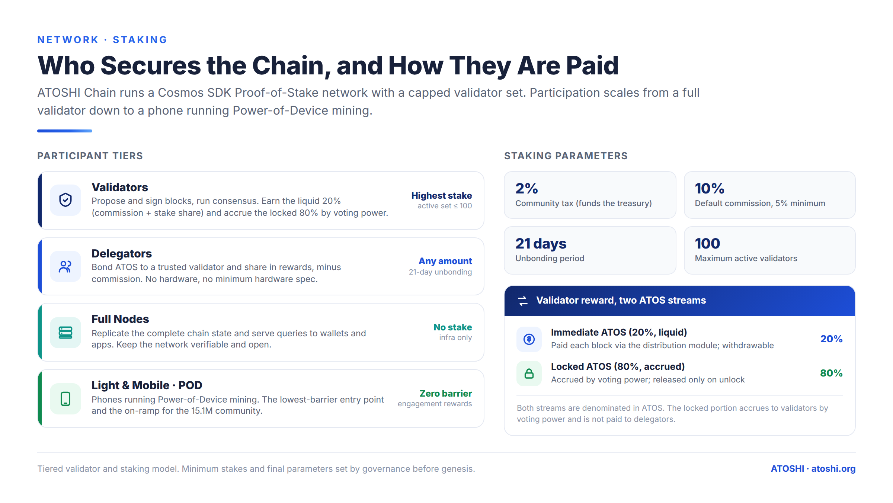

# 质押 — 验证人经济学

Atoshi L1 是一条 Cosmos SDK 的**权益证明(Proof-of-Stake)**网络,由一个数量封顶、
运行 CometBFT 共识的验证人集合来保障安全。本章介绍谁在保障这条链的安全、
他们如何获得报酬,以及质押参数。数值化的奖励模型(区块奖励、减半、锁定的 80%)
见 [区块奖励](../economics/04-block-rewards.md);释放机制
见 [释放计划](../economics/02-release-schedule.md)。

## 参与层级

参与方式从完整的验证人一直下探到一部手机:

- **验证人(Validators)** —— 出块并签名、运行共识。赚取流动的 20%(佣金 + 自身质押份额),并按投票权累积锁定的 80%。活跃集合上限为 100。
- **委托人(Delegators)** —— 将 ATOS 绑定(bond)给某个验证人,并分享扣除佣金后的奖励。无需硬件,任意金额皆可。
- **全节点(Full nodes)** —— 复制完整的链状态,并为钱包和应用提供查询服务。无需质押。(参见 [节点运维](../reference/node-operation.md)。)
- **轻/移动客户端(Light / mobile clients)** —— 应用层的 Power-of-Device 参与层级;是通向更广泛社区的入口。这是一个生态产品概念,与 L1 共识不同。

## 质押参数

网络启动时采用保守、标准的 Cosmos 质押参数。最终数值在创世前由治理确认。

| 参数 | 数值 |
|---|---|
| 社区税(Community tax) | 2%(为链上国库提供资金) |
| 默认佣金(Default commission) | 10%(建议最低 5%) |
| 解绑期(Unbonding period) | 21 天 |
| 最大活跃验证人数 | 100 |

**2% 的社区税**在分配前从即时区块奖励流中抽取,为受治理控制的国库提供资金。**21 天的解绑期**是标准的 Cosmos 安全窗口,在此期间处于解绑状态的质押仍可被 slashing,且不可转移。

## 验证人奖励:两条 ATOS 流

每个区块铸造 **19,819 ATOS**,分为两条流(完整模型见 [区块奖励](../economics/04-block-rewards.md)):

- **即时部分 —— 20%(3,963.8 ATOS/区块)。** 发送至手续费收取器(fee collector),扣除 2% 社区税后,再通过 Cosmos SDK 的 `x/distribution` 模块支付给验证人(佣金)及其委托人(质押份额)。可流动、可提取。
- **锁定部分 —— 80%(15,855.2 ATOS/区块)。** 按投票权比例分配给验证人,记录为 `MinerLockedBalance.locked_amount`。**不**支付给委托人。只有当某个条件档位释放触发时才变得可花费 —— 从而将验证人收入与持续的长期价值绑定,而非短期抛售。

图中的基准数字(自质押、网络质押、ROI)是对该模型在既定假设下行为方式的举例说明,并非承诺的回报。

## Slashing 与活跃度(liveness)

验证人必须保持在线并持续签名。在签名窗口内漏签过多区块会导致被监禁(jailing);待停机窗口结束后,用 `atoshid tx slashing unjail` 恢复。双签(等价行为,equivocation)会受到更严厉的惩罚。绑定给被 slashing 验证人的委托抵押品会按比例分担惩罚;而持有于能量模块中的能量委托抵押品是 bank 隔离的,不会暴露于质押 slashing 之下(参见 [能量](./01-energy.md))。

## 相关

- [区块奖励](../economics/04-block-rewards.md) —— 完整的奖励/减半模型
- [释放计划](../economics/02-release-schedule.md) —— 锁定的 ATOS 何时解锁
- [节点运维](../reference/node-operation.md) —— 运行验证人或全节点
- [治理](./09-governance.md) —— 质押参数如何变更

---

*最后审阅:2026-07-12*
